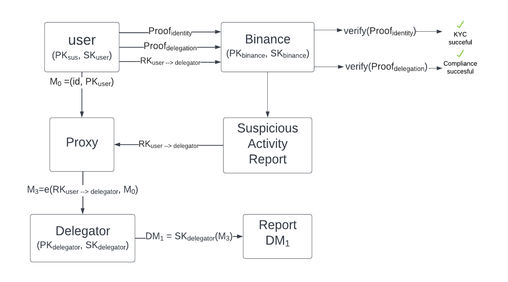

# ZeroID


⚠️ Note: The purpose of this protocol is not to provide a definition of identity or how to validate them. The intents is to facilitate the distribution issuance and verification of the identities in a completely private and sovereign manner.

⚠️ Note: The purpose of this protocol is not to provide a definition of identity or how to validate them. The intents is to facilitate the distribution issuance and verification of the identities in a completely private and sovereign manner.

As per the W3C DID standard the table below identifies the impact of benefits of decentralised identities:
| Goal | Description |
|---|---|
| Decentralization | Eliminate the requirement for centralized authorities or single point failure in identifier management, including the registration of globally unique identifiers, public verification keys, services, and other information. |
| Control | Give entities, both human and non-human, the power to directly control their digital identifiers without the need to rely on external authorities. |
| Privacy | Enable entities to control the privacy of their information, including minimal, selective, and progressive disclosure of attributes or other data. |
| Security | Enable sufficient security for requesting parties to depend on DID documents for their required level of assurance. |
| Proof-based | Enable DID controllers to provide cryptographic proof when interacting with other entities. |
| Discoverability | Make it possible for entities to discover DIDs for other entities, to learn more about or interact with those entities. |
| Interoperability | Use interoperable standards so DID infrastructure can make use of existing tools and software libraries designed for interoperability. |
| Portability | Be system- and network-independent and enable entities to use their digital identifiers with any system that supports DIDs and DID methods. | 
| Simplicity | Favor a reduced set of simple features to make the technology easier to understand, implement, and deploy. |
| Extensibility | Where possible, enable extensibility provided it does not greatly hinder interoperability, portability, or simplicity. |

## Introduction

The following README describes the series of techniques that have to be in place to create and manage decentralised, fully private, and sovereign identities.

The system does partly rely on third parties and their issuance authority to generate a level of conviction around the ownership of the identity.

It will however heavily rely on the WW3 DID standards for those who chose to not recognise or trust them, like we at zeroid do.

The protocol is interactive in the sense that verification is not stored and later retrieved by a third party wanting to verify but rather the proof genaration happens as a result of a request from the verifier.

ZeroID has two main actors. A prover and a verifier

## Prover

A prover is an actor that wants to demonstrate they posses certain characteristic, meet specific criteria, or that they are who they claim to be.

A prover does not set out to prove his identity, but instead generates and manages a portfolio of verifiable units.
All together they make up an identity or the elements the prover wishes to be identified for.

A proof is made up of two simple elements. The verifiable unit, and the users biometrics.

Proof elements:

```sh
{ verifiable_unit_hash: "5514eebea38bf2ac072b06c10f7fd78dc2f3b11647a75900ac86630f24825a85", biometrics_hash: "5dd1f5f328270cc967ba4c0ba2bd3fcee9a18a95bf3dd24b55ddb4e2900ed9fd"}
```

These are then combined into a single hash:

```sh
{ proofHash: "e324d4e4370747238ef360a268476e40ace023d7d0574774fd125b5cc4e25623"}
```

Therefore for a given hash of the users biometrics and knowledge of preimage of the veriafiable unit we can proof a user has tied its biometrics to a specific number.

Both the biometrics and verifiable unit are determined, proved, and then discarded in the device. They are never socialised stored or leave the devices in any shape way or form.

## Verifier

The verifier is the person that wants to ensure the elements in a zeroid are correct and as advertised. A verifier will always ask for three things:

- A random secret to be included in the proof
- A verified biometirc that matches the one in the other elements
- The sub-proofs they want to verify

```sh
{ uuid: "9cf447c2-de1b-463e-8699-3fde74605bbc", biometrics: true, verifiable_unit: [ age ] }
```

This data allows the verifier to:

- Ensure the proof is unique and matches the request, its has not been reused
- The prover is not impersonating a third party
- The provers biometrics match the ones used for the creation of the verifiable units.

This process describes a three step insurance policy seamlessly integrated into a recursive zero knowledge proof.

## Origination

Just because a user has ties their biometrics to a number, whether that is the number of their drivers license, their social security, or their lucky lotto number doesnt mean that it holds any value, and therefore doesnt mean he can be identified by that number.

```text
How can we trust that the information against which we generate a proof is correct and true?
```

Great  question, like with all complicated questions the answer depends on what youre trying to verify.

### Centralised originators

Centralised Originations like:

- National IDs
- Passports
- Driving licenses

Cannnot be verfied by any third party, but once they are verified, by an authorised vendor, all the associated information can be turned into verifiable units. 

At that point we will be able to proof the verification from a trusted party has occured for that specific verifiable unit while offering no information that ties you back to the service.

This is possible thanks to a combination of single hop proxy re-encryption and zero knowledge proofs.
Consider the following scenario:

```text
A user wants to generate a verifiable unit for their birthday, and it has its passport on hand.
The user would pass a KYC process with an authorised 3rd party. and receive an uuidv4 once he succesfully passes the KYC process. 
We have to carry out some precautionary steps to prevent information leakage. 
- Encrypt our ID with our public key(PubK).
- Generate a proof of knowledge of pre-image for the encrypted key(Pid). 
- Generate a reencryption key (ReK)
- Generate a Proof of delagation(Pdel) of the ReK, so the receiver can ensure they received the right ReK
```

At this point we are prepared to:

- Proof any element of the verified document, including the birthday.
- Hand over an encrypted reference of the key to a proxy
- Hand over the re-encryption key to any party that requires it for compliance reasons.
- Proof we handed over the correct key.

What about compliance in the case of bad actors?
With the above set up we have ensure the following process can take place:

1. Any service that has requested a centrally originated verifiable unit will also receive the re-encryption key for the ID of the service that verified the information.
2. In case foul play is suspected the suspecting entity will renecrypt the original message in the proxy and hand over the supporting evidence to a delegator.
3. The delegator will examine the evidence and will determine if they decrypt the Identifier from the proxy and initiate legal procedures with the help of the verification company.

A picture is worth more than one thousand words so here you go:


### Decentralised originators

Decentralised identities make up other elements of your life things that, for now, dont have an army. Like:

- Universities
- Schools
- Social media
- Phone providers
- Your landlord
- A friend

Your identity is yours to share and socialise. But the more present you make yourself the more trustworthy you are.

If you dont want to delegate your identity to governemnts you can build social credit. It doesnt mean every place will accept your score or that entities have any obligation to accept even the highest of scores, It just means that if you want to tell the government to go fuck it self then I genuinely belive you should have, at the very least, the option to do so.

⚠️ This is not a social scoring system, if you want a dystopia go hit up blackmirror. This is just a meassure of how likely it is that you are who you claim to be based on a series of recommendations/recognitions from peers, institutions and businesses.

There will be some very clear delimitations on how decentralised identities are marked up or down, and they will ofcourse be more succeptible to attacks by third parties.

### How does a decentralised origination happen?

great questions lmao.

## Reference Implementation Details

- Proof system: PlonK
- Verification on-chain (mainnet, FRI curve) of a PlonK proof
- FRI: proof composition, no need for a trusted setup, no need for a pairing-friendly curve
- The proof verification (solidity smart contract) will be PlonK + FRI and is not tied to a particular
use-case.

⚠️ Note: PlonK can be instantiated with 2 polynomial commitment schemes

## Definitions

Central uthority/ies - An agency or organization that is designated to play a key facilitating role in the implementation and operation of an international treaty in public and private international law.

biometrics
device
Centralised Originations
Decentralised Originations
